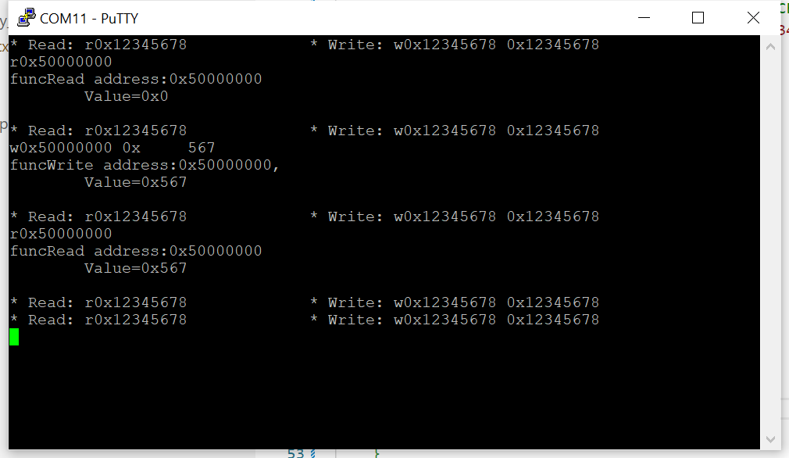

# 02_repl

## 2.1 Create a REPL to Read/Write RP2040 Registers From a Console

- Select any 32-bit address to read/write (even if not a valid RP2020 address)
- Read/write any 32-bit value to this address
- Read/write using any of the atomic bit-setting aliases and a 32-bit mask

## 2.2 Result

