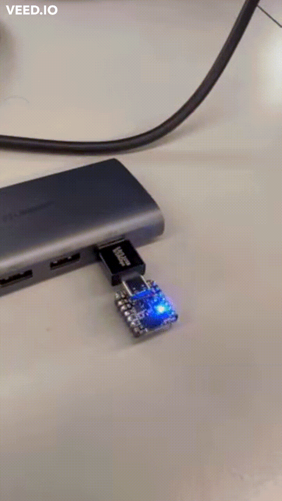

# 03_sequencer

## 3.1 Combine 01 and 02

Create a 'sequencer' that allows you to record BOOT button presses and play them on the Neopixel, and also play a sequence of read/write commands. You should be able to:

- record at a least a few seconds of button input to your RP2040 (in RAM)
- replay a recorded sequence on your NeoPixel
- loop a recording
- save a recording to your laptop (the Python Serial library is one way to do this)
- play a recording from your laptop
- record 'macros' (a sequence of console commands) based on keystrokes in your serial console
- hand-edit a list of register read/write commands on your laptop, and play them on the RP2040
- include multiple I/O sources in a recording, and remap among the following:
	- inputs: BOOT button, console commands, register read/write commands
	- outputs: neopixel color, neopixel brightness, data over serial, register read/write commands

## 3.2 Result

Play the recording with normal speed and then the slow motion speed.

## 3.3 Notes

- Junpeng mentioned that file also nned to records the sampling frequency, since without adjusting <frequency>, REPL will replay with the recorded frequency.

- Junpeng suggested that to read the address easier via serial, he recommand us to used `scanf("%08x",&addr)` instead of `getchar_nonblocking`. A potential drawback is that it may introudce blocking time when reading from serial.
