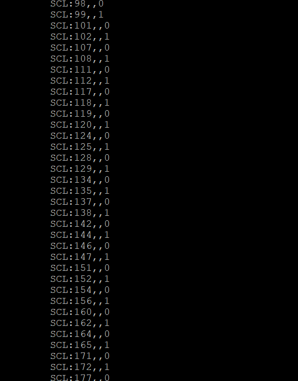
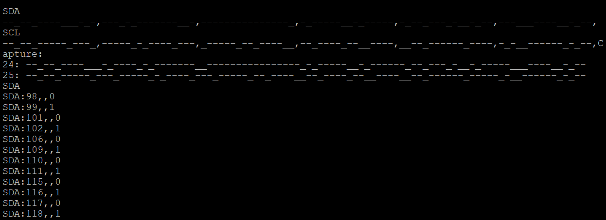

# 06_pioscope

## 6.1 Pio Scope

- Modify the PIO/DMA logic analyzer example to record a timestamped trace of an RP2040-ADPS9960 exchange while the BOOT button is pressed.
- With a partner, connect a second Qt Py to the Stemma Qt bus of an ADPS9960 that's attached to a first Qt Py running the Lab 1 Python code.
- Record a trace of this exchange.

## Results
Plot the serial output of SCL

and SDA

## 6.3 Notes

See useful notes [here](https://github.com/PZZ97/ese5190-2022-lab2b-esp/blob/main/lab/06_pioscope/useful_notes/Note.md).