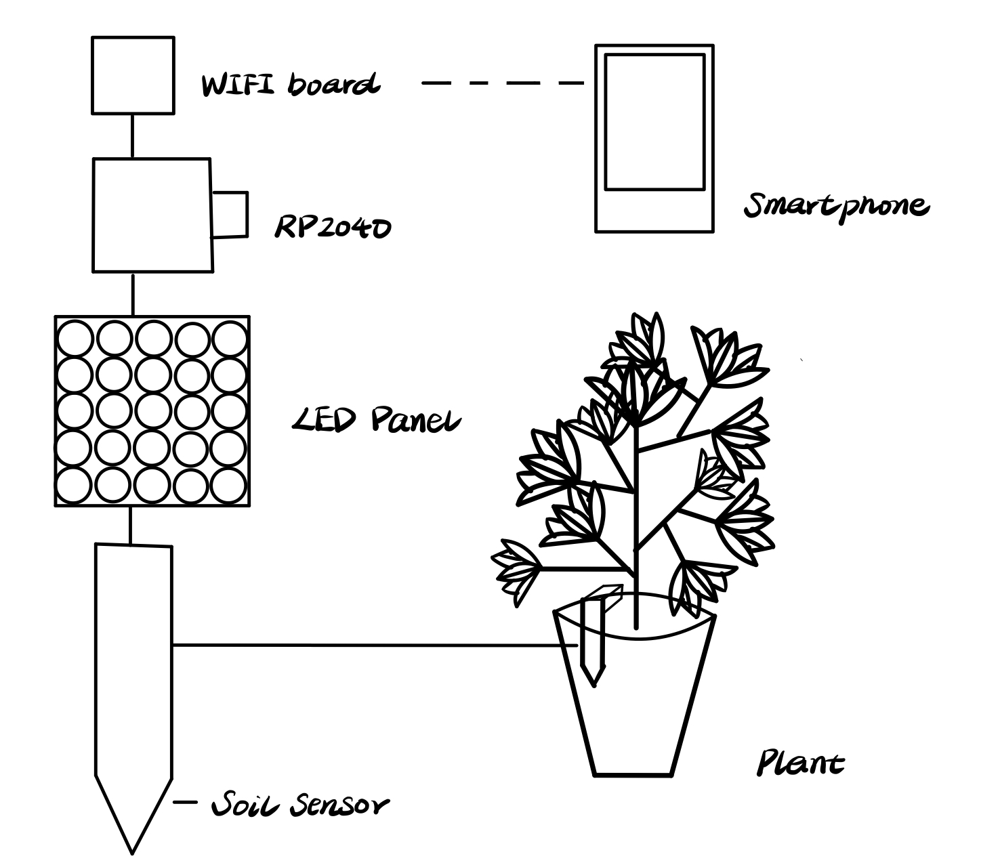

# ese5190-2022-lab2-2B

## I - Proposal

### 1.1 Gif of my breadboard LED in action

I write a python to automatally turn on and off the LED. When setthing the LED value to true, the light will be turned on and print "ON"; when setthing the LED value to false, the light will be turned off and print "OFF".

### 1.2 Proposal
I want to build a soil humidity monitor which can be put into the soil of a plant to sense the humidity of the soil. If the humudity is lower than an expected value, the LED panel will be turned on to show a "L" (for low) or sad face emoji, the Wifi part will also be turned on and message that remain me to wataer the plant will be sent to my mobile device.

I think this idea is cool because I love growing plants in my apartment, but I always forgot to water my plants so some of them dead :(.  I believe this device can assist me to grow my plants better.

### 1.3 Components requested from Detkin
Components | Quantity
:---: | :---:
Soil Sensor | 1
LED Panel | 1
Wifi Chip | 1
Battery | 1
Wires | Many

### 1.4 Final Version - Sense Light

